## **Tugas Praktikum (Pegawai)**

### 1. Tampilkan pegawai yang gajinya bukan 2.000.000 dan 1.250.000 !

`select*from pegawai where gaji not in ('2000000','1250000');`
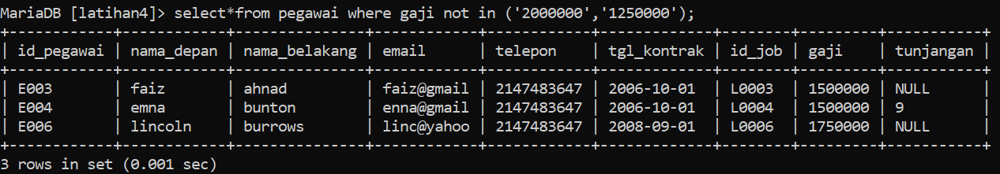

### 2. Tampilkan pegawai yang tunjangannya NULL

`select*from pegawai where tunjangan in ('NULL');`
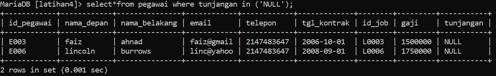

### 3. Tampilkan pegawai yang tunjangannya tidak NULL!

`select*from pegawai where tunjangan not in ('NULL');`
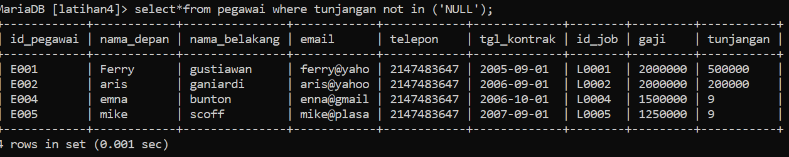

### 4. Tampilkan hitung jumlah baris /record tabel pegawai!

`desc pegawai;`
`select*from pegawai;`
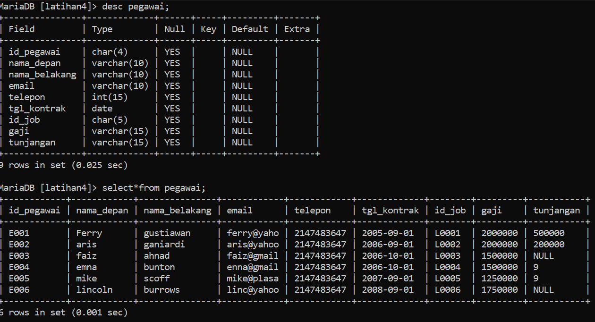

### 5. Tampilkan hitung jumlah total gaji di tabel pegawai

`select sum(gaji) as jumlah from pegawai;`
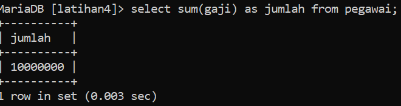

### 6. Tampilkan hitung rata rata gaji pegawai

`select avg(gaji) as rerata from pegawai;`
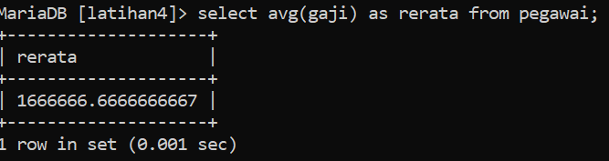

### 7. Tampilkan gaji terkecil

`select min(gaji) as terkecil from pegawai;`
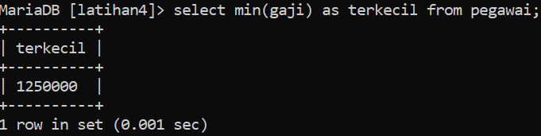

### 8. Tampilkan gaji terbesar

`select max(gaji) as terbesar from pegawai;`
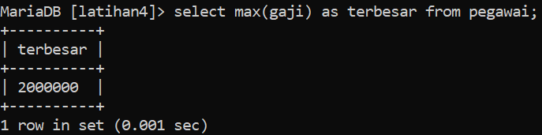

## **Tugas Praktikum (hewan)**

### 1. Tampilkan jumlah hewan yang dimiliki setiap owner.

`select count(owner) as jumlah from hewan;`
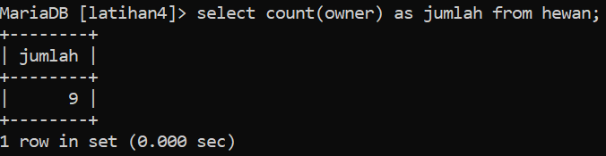

### 2. Tampilkan jumlah hewan berdasarkan spesies

`select count(species) as jumlah from hewan;`
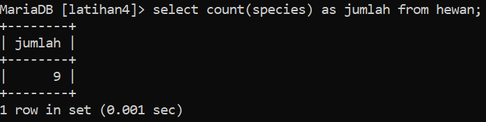

### 3. Tampilkan jumlah hewan berdasarkan jenis kelamin

`select count(sex) as jumlah from hewan;`
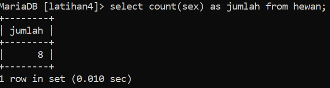

### 4. Tampilkan jumlah hewan berdasarkan spesies dan jenis kelamin

`select count(species), count(sex) as jumlah from hewan;`
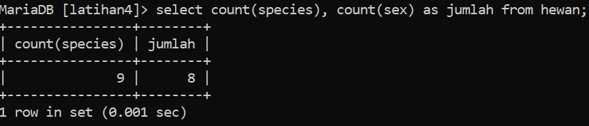

### 5. Tampilkan jumlah hewan berdasarkan spesis (cat dan dog saja) dan jenis kelamin

skip
`select*from hewan where species in ('cat', 'dog');`

### 6. Tampilkan jumlah hewan berdasarkan jenis kelamin yang diketahui saja

skip
`select * from hewan where sex is not null;`

### Kesimpulan

benar tapi beda aturan (aturan sesuai pertanyaan) tetapi sama kolom baris